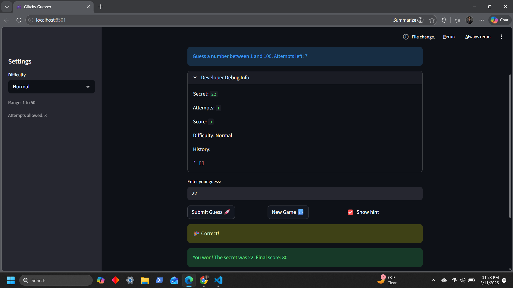

# 🎮 Game Glitch Investigator: The Impossible Guesser

## 🚨 The Situation

You asked an AI to build a simple "Number Guessing Game" using Streamlit.
It wrote the code, ran away, and now the game is unplayable. 

- You can't win.
- The hints lie to you.
- The secret number seems to have commitment issues.

## 🛠️ Setup

1. Install dependencies: `pip install -r requirements.txt`
2. Run the broken app: `python -m streamlit run app.py`

## 🕵️‍♂️ Your Mission

1. **Play the game.** Open the "Developer Debug Info" tab in the app to see the secret number. Try to win.
2. **Find the State Bug.** Why does the secret number change every time you click "Submit"? Ask ChatGPT: *"How do I keep a variable from resetting in Streamlit when I click a button?"*
3. **Fix the Logic.** The hints ("Higher/Lower") are wrong. Fix them.
4. **Refactor & Test.** - Move the logic into `logic_utils.py`.
   - Run `pytest` in your terminal.
   - Keep fixing until all tests pass!

## 📝 Document Your Experience

- [x] Describe the game's purpose.
   A Streamlit-based number guessing game where players attempt to guess a secret number within a set range determined by difficulty level (Easy: 1-20, Normal: 1-50, Hard: 1-100). The game provides hints to guide players higher or lower, tracks attempts, and awards points based on performance.

- [x] Detail which bugs you found.
   1. **Backwards Hint Messages**: When a guess was higher than the secret number, the hint incorrectly said "Go HIGHER!" instead of "Go LOWER!"
   2. **Unstable Secret Number**: On even attempts, the code converted the secret number from an integer to a string, causing comparison logic to fail.
   3. **Difficulty Range Mismatch**: The Normal difficulty range (1-100) was higher than the Hard difficulty range (1-50), making hard mode easier.
   4. **Incorrect Scoring**: The update_score() function added points for "Too High" on even attempt numbers.
   5. **Winning Attempt Penalty**: The scoring system penalized winning attempts with an extra attempt count.

- [x] Explain what fixes you applied.
   1. **Fixed Hint Logic**: Swapped the hint messages so guesses higher than the secret say "Go LOWER!" and guesses lower say "Go HIGHER!"
   2. **Stabilized Secret Number**: Removed the "if" condition that converted secret number to a string on even attempts, ensuring integer comparison logic works correctly.
   3. **Corrected Difficulty Ranges**: Swapped ranges so Normal is 1-50 and Hard is 1-100.
   4. **Fixed Scoring System**: Removed the conditional logic that added points for "Too High" on even attempts.
   5. **Removed Attempt Penalty**: Refactored the scoring calculation to not penalize winning with extra attempts.

## 📸 Demo

- [x] [Insert a screenshot of your fixed, winning game here]
   

## 🚀 Stretch Features

- [ ] [If you choose to complete Challenge 4, insert a screenshot of your Enhanced Game UI here]
